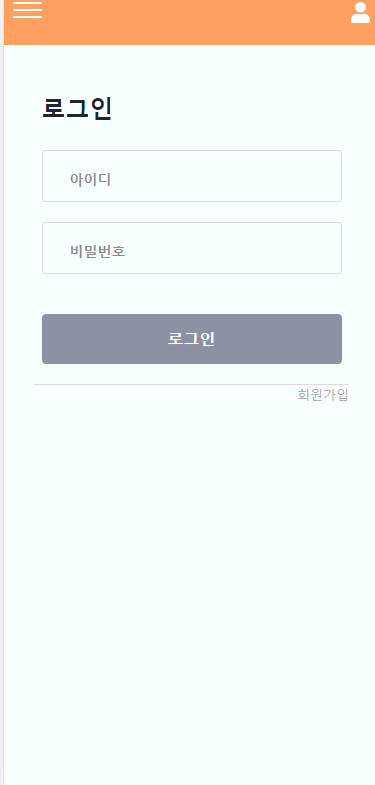
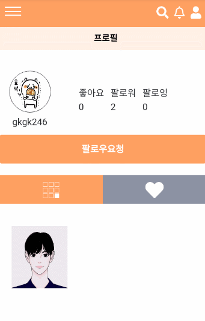
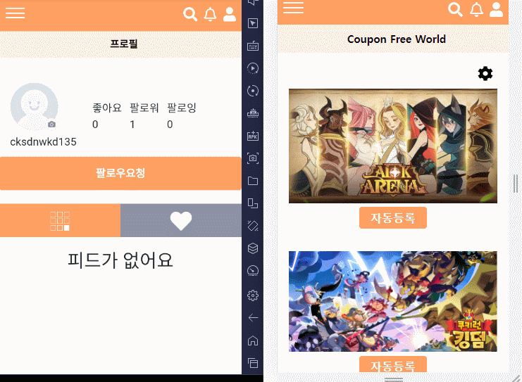

# Coupon Free World

> 모바일 게임 쿠폰 자동등록 서비스 구성
>
> SNS기본기능(자유게시판, 피드, 알림, 프로필) 서비스 구성

## 0. 프로젝트 개요

프로젝트 왜 만들었지?? 그리고 UCC와 배포사이트 URL넣기

## 1. 팀원 역할

- 모진혁(팀장&BackEnd)
  - 
- 민찬우(FrontEnd)
  - 회원관리 로직& Styling
  - 피드 어쩌구 저쩌구
  - 이것저것 어쩌구 저쩌구 ㅇㅠㅇ
- 이수현(FrontEnd)
  - 

## 2. 개발 도구

## 3. ERD

## 4. 컴포넌트 구조

## 5. 기능
### 5.1 회원관리

- 회원가입

  

- 로그인

- 회원수정

### 5.2 메인(쿠폰 자동등록)

- 쿠폰 관리자
- 자동등록

### 5.3 자유게시판

- 게시판 CRUD
- 게시판 검색
- 게시판 댓글

### 5.4 피드

- 피드 CRUD

### 5.5 프로필&알림

- 프로필
  - 유저 검색(Create, Read, Delete 로직이 필요)

    

    - 입력된 값과 유사한 유저아이디를 보여줍니다.
    - 검색된 값을 클릭시 해당 유저의 프로필로 이동하며, 최근검색에 최신순으로 기록이 남습니다.
    - 최근검색된 유저아이디를 클릭시 해당 유저의 프로필로 이동합니다.
    - 최근 검색값들은 삭제도 가능합니다.  
    
  - 프로필화면 기능(Read 로직 필요)
  
    
    
    - 다른 유저에게 팔로우 요청및 요청취소를 할 수 있습니다.
    - 해당 유저의 작성한 피드와 좋아요 누른 피드를 확인할 수 있습니다.
    - 본인 프로필에서는 회원정보 수정이 가능합니다.
  
- 알림및 팔로우

  - 팔로우 요청에 대한 알림 및 수락(CRD로직&Socket[1] 필요)

    
    
    - 'cksdn135' 유저가 'cksdnwkd135'에게 팔로우 요청시 화면 하단에 알림 메시지가 나옵니다.
    - 오른쪽 상단 알림 아이콘 클릭시 새로운 알림이 들어와 있는것을 확인할 수 있습니다.
    - 해당 알림을 클릭시 그 알림내용은 삭제가 됩니다.
    - 더보기를 클릭시 팔로우 수락할 수 있는 페이지로 이동합니다.

## 6. 느낀점

- 모진혁
  - 
- 민찬우
  - 진행하면서 뿌듯함을 느낄 수 있었고, 어쩌고 저쩌고 끄적끄적 ㅇㅠㅇ
- 이수현
- 

## Bibliography

[1] https://m.blog.naver.com/ppuagirls/221491066847

