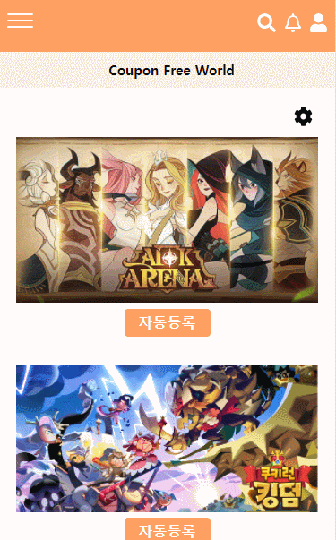

# Coupon Free World

> 모바일 게임 쿠폰 자동등록 서비스 구성
>
> SNS기본기능(자유게시판, 피드, 알림, 프로필) 서비스 구성

## 0. 프로젝트 개요

많은 모바일 게임들이 사용자들에게 무료로 쿠폰을 제공하곤 합니다.

하지만 이러한 서비스와는 달리 해당 쿠폰을 게임 내에서 등록하는 것이 아니라, 외부 커뮤니티를 통해 쿠폰 번호를 제공받고 또다른 웹 사이트를 통해 쿠폰을 등록해야하는 복잡한 과정을 갖습니다.

이를 하나의 과정으로 통합하므로써 사용자에게 편리함을 제공할 뿐만 아니라, 자신이 어떤 쿠폰을 등록했는지 안했는지 고민할 필요를 없애줍니다. 

또한 복잡한 과정을 따로 공부할 필요 없이 신규 유저에게도 게임을 좀 더 쉽게 다가가게 할 것을 기대합니다.

UCC : https://www.youtube.com/watch?v=wWj9dXl1kcI

배포사이트 : http://i5c101.p.ssafy.io/

## 1. 팀원 역할

- 모진혁(팀장&BackEnd)
  - Aws s2에 이미지 업로드 구현
  - 쿠폰 번호 크롤링/등록
  - 알람기능 백엔드부분 구현
  - 이메일 인증 백엔드부분 구현
  - 배포작업
  - 프로필 부분 프론트/백엔드 구현 
- 민찬우(FrontEnd)
  - 회원가입&로그인 로직, 회원가입&로그인 기능위주의 Styling
  - 회원수정 로직과 Styling
  - 실시간 피드 목록&팔로우한 피드 목록&피드 생성&피드 디테일&피드 삭제&피드 좋아요 로직
  - 실시간 피드 목록&팔로우한 피드 목록&피드 생성 페이지 Styling
  - 유저 검색 로직과 Styling
  - 알림 로직
  - 메인페이지(쿠폰등록)&사용자게임관리 로직과 Styling
  - 메뉴바 로직과 Styling
- 이수현(FrontEnd)
  - 자유게시판 게시글 CRUD 구현
  - 게시판 검색 기능 구현
  - 전체 목록 or 검색 목록 페이지네이션 구현
  - 피드/게시판 게시물 및 댓글 UI/UX 
  - 피드 pagination 활용한 Carousel 구현
  - 프로젝트 전반적 styling
  - 발표 및 UCC
  
  

## 2. 개발 도구

## 3. ERD

## 4. 컴포넌트 구조

## 5. 기능
### 5.1 회원관리

- 회원가입

  

  - 회원가입시 이메일 인증을 진행합니다. 
  - 이메일 인증 성공시 회원가입 페이지로 이동하게 됩니다.

  - 회원가입시 ID 중복검사를 진행하여 똑같은 ID가 존재한다면 다른 ID로 가입을 진행합니다.

- 로그인

  

  - DB에 저장된 데이터와 비교하여 ID,PW가 일치한 Data가 존재한다면 JWT토큰을 발행하고 JWT토큰을 웹 브라우저 쿠키에 저장.

- 회원수정

  

  - 회원 정보 수정을 통해 닉네임, 자기소개, 비밀번호, 사용자의 프로필 사진등을 변경할 수 있습니다.

  

### 5.2 메인(쿠폰 자동등록)

- 회원 코드 관리

  

  메인 화면의 환경 설정(톱니 바퀴) 버튼을 통해

  각 게임당 1계정씩 회원코드를 등록할 수 있습니다.

  한 번 등록해 놓으면 수정 시까지 저장된 채로 유지됩니다. 

  

- 쿠폰 등록 자동화

"자동 등록" 버튼을 누르면 자신이 위에서 저장해놓은 회원코드에 

유효기간이 남아있지만 아직 회원이 등록하지 않은 쿠폰들을 자동으로 전부 등록합니다.

(단, AFK 아레나 게임은 게임 내에서 인증번호를 확인해야 합니다.)

위 과정 두 가지를 거치면 다음과 같이 쿠폰이 정상적으로 모두 등록되었음을 확인할 수 있습니다.

### 5.3 자유게시판

- 게시판 CRUD

  

  글쓰기 버튼을 통해 글을 등록합니다.

  글을 쓸 때 카테고리를 설정하지않으면 "일반" 카테고리를 갖으며, 일반 카테고리 혹은 특정 게임 카테고리를 선택하여 글을 작성할 수 있습니다.

- 게시판 댓글

  

  댓글을 작성, 삭제 할 수 있으며 기존 댓글에 답글을 달 수 있습니다.

  답글일 달린 댓글이 부모, 답글이 자식이라고 할 때 부모 댓글은 또다른 부모를 가질 수 없습니다.

  즉 원 댓글은 단 하나이며, 그에 대한 여러 개의 답글이 달릴 수 있습니다.

- 게시판 검색

  

  게시판 메인 화면 상단에 위치한 검색어 창에 키워드를 넣고 엔터 혹은 버튼을 누를 시 검색어와 일치하는 제목을 가진 글들이 나타납니다. sql으로 column을 제목을 설정하고, 해당 column 에 키워드가 있는지 검색하는 api 를 구현하였습니다.

### 5.4 피드

- 피드 CRUD

  

  대표 사진 (필수) 하나를 포함한 사진과 함께 간단한 글을 작성할 수 있습니다.

  작성된 게시물의 사진이 여러 개 일 경우 좌 우로 사진을 넘길 수 있습니다.

  

  

  작성된 피드는 모든 피드 리스트 혹은 자신이 팔로우한 사용자의 피드 두 가지로 선택하여 피드 목록을 볼 수 있습니다. 자신이 작성한 피드만 보고싶을 경우에는 "프로필" 에서 확인해야 합니다.

### 5.5 프로필&알림

- 프로필
  - 유저 검색(Create, Read, Delete 로직이 필요)

    

    - 입력된 값과 유사한 유저아이디를 보여줍니다.
    - 검색된 값을 클릭시 해당 유저의 프로필로 이동하며, 최근검색에 최신순으로 기록이 남습니다.
    - 최근검색된 유저아이디를 클릭시 해당 유저의 프로필로 이동합니다.
    - 최근 검색값들은 삭제도 가능합니다.  
    
  - 프로필화면 기능(Read 로직 필요)
  
    
    
    - 다른 유저에게 팔로우 요청및 요청취소를 할 수 있습니다.
    - 해당 유저의 작성한 피드와 좋아요 누른 피드를 확인할 수 있습니다.
    - 본인 프로필에서는 회원정보 수정이 가능합니다.
  
- 알림및 팔로우

  - 팔로우 요청에 대한 알림 및 수락(CRD로직&Socket[1] 필요)

    
    
    - 'cksdn135' 유저가 'cksdnwkd135'에게 팔로우 요청시 화면 하단에 알림 메시지가 나옵니다.
    - 오른쪽 상단 알림 아이콘 클릭시 새로운 알림이 들어와 있는것을 확인할 수 있습니다.
    - 해당 알림을 클릭시 그 알림내용은 삭제가 됩니다.
    - 더보기를 클릭시 팔로우 수락할 수 있는 페이지로 이동합니다.

## 6. 느낀점

- 모진혁
  
  - 설계작업부터 시작하여 많은 경험을 해볼 수 있는 프로젝트였고 프로젝트를 진행하면서 많은 기능을 구현해보면서 다양한 기술들을 접해볼 수 있는 경험이었습니다. 특히 AWS의 EC2를 통하여 배포를 직접 해보면서 리눅스와 AWS에 관해 공부를 해보는 계기가 되었고 개발자로서 지속적인 공부의 중요성을 느끼게 되었습니다.
- 민찬우
  
  - [좋은 코드를 위한 노력]
  
    프로젝트에서 `함수형 Javascript 프로그래밍`을 하려고 노력하였습니다. 중앙 집중식 저장소인 Vuex에서 자주쓰는 로직을 함수형 프로그래밍으로 구현, 공용으로 이용하는 api들도 따로 폴더를 만들어 구현을 하였습니다. 이로 인해 복잡한 문제를 간결한 코드로 해결할 수 있을 뿐만 아니라 재활용과 유지보수면에서 높은 효율성을 얻을 수 있었습니다. 따라서 이번 프로젝트로 인해서 프로그래밍에 대한 좋은 습관을 기를 수 있었고, 팀원들과의 코드 리뷰에서 커뮤니케이션과 가독성을 증진시킬 수 있었습니다.
  
  - [프로젝트 성공을 확률을 올리기 위한 노력]
  
    이번 프로젝트에서 개발을 구조화하고 성공 확률을 높이기 위해서 에자일 모델 처음 사용해 보았습니다. 이를 효율적으로 이용하기 위해서 JIRA를 이용하였습니다. 각각의 기능을 작은 단위로 모듈화하고 우선순위가 높은 순서데로 하나하나 진행하였습니다. 이로 인해 위험의 크기는 줄이고 지속적인 진화를 통해 보다 빠르게 목표를 달성할 수 있게 되어서 좋았습니다. 즉, 유연성이 좋았습니다. 또한 팀원간에 커뮤니케이션이 줄어들며 개발에 몰두할 수 있었고, 현재 팀원이 어떤것을 수행하고 있는지도 알 수 있어서 워터풀한 방법론보다 효율성이 좋다고 느꼈습니다. 마지막으로 각각의 스프린트가 끝나고 다른 팀의 분들에 대한 피드백을 통해 유지보수와 개선을 더 향상 시키므로써 좋은 프로젝트가 된 것 같아 뿌듯하였습니다.
- 이수현
  - 평소 Django를 이용한 서버 개발을 한 반면 이번 프로젝트를 통해 Spring 서버에서 어떻게 데이터를 Front와 주고받는 지 경험할 수 있었다. 백엔드에서 단순히 변수를 넘기는 것이 아니라 api 를 사용하여 데이터를 주고 받는 방법에 대해 공부하고 데이터를 주고받기 위해 만들어 놓은 함수가 필요할 때마다 불러와 재사용한다는 점을 보며 백과 프론트에 상호작용 관계를 파악할 수 있었다.

  - Django에서는 보통 로컬에서 DB를 조작하기 위해 sqlite3를 사용하였지만, mysql을 사용한 것이 가장 특이하다고 느꼈다. 이번 프로젝트는 1학기와 다르게 사용자에게 "배포"하는 것에 큰 의의가 있으므로, 그런 의미에서 다수의 이용자에게 대응 가능한 MySQL이 적합하다고 판단하였다. MySQL의 장점과 방법을 익힘과 동시에, 다른 dbms를 사용함으로써 sqlite3의 단순함이 로컬 개발에 있어 매우 편리한 편이라는 점을 새삼 느끼게 되었다.

    

## Bibliography

[1] https://m.blog.naver.com/ppuagirls/221491066847

