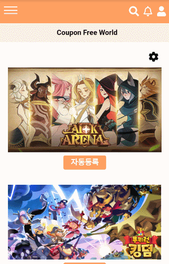

# Coupon Free World

> 모바일 게임 쿠폰 자동등록 서비스 구성
>
> SNS기본기능(자유게시판, 피드, 알림, 프로필) 서비스 구성

## 0. 프로젝트 개요

프로젝트 왜 만들었지?? 그리고 UCC와 배포사이트 URL넣기

## 1. 팀원 역할

- 모진혁(팀장&BackEnd)
  - Aws s2에 이미지 업로드 구현
  - 쿠폰 번호 크롤링/등록
  - 알람기능 백엔드부분 구현
  - 이메일 인증 백엔드부분 구현
  - 배포작업
  - 프로필 부분 프론트/백엔드 구현 
- 민찬우(FrontEnd)
  - 회원가입&로그인 로직, 회원가입&로그인 기능위주의 Styling
  - 회원수정 로직과 Styling
  - 실시간 피드 목록&팔로우한 피드 목록&피드 생성&피드 디테일&피드 삭제&피드 좋아요 로직
  - 실시간 피드 목록&팔로우한 피드 목록&피드 생성 페이지 Styling
  - 유저 검색 로직과 Styling
  - 알림 로직
  - 메인페이지(쿠폰등록)&사용자게임관리 로직과 Styling
  - 메뉴바 로직과 Styling
- 이수현(FrontEnd)
  - 

## 2. 개발 도구

## 3. ERD

## 4. 컴포넌트 구조

## 5. 기능
### 5.1 회원관리

- 회원가입

  

  - 회원가입시 이메일 인증을 진행합니다. 
  - 이메일 인증 성공시 회원가입 페이지로 이동하게 됩니다.

  - 회원가입시 ID 중복검사를 진행하여 똑같은 ID가 존재한다면 다른 ID로 가입을 진행합니다.

- 로그인

  

  - DB에 저장된 데이터와 비교하여 ID,PW가 일치한 Data가 존재한다면 JWT토큰을 발행하고 JWT토큰을 웹 브라우저 쿠키에 저장.

- 회원수정

  

  - 회원 정보 수정을 통해 닉네임, 자기소개, 비밀번호, 사용자의 프로필 사진등을 변경할 수 있습니다.

  

### 5.2 메인(쿠폰 자동등록)

- 쿠폰 관리자
- 자동등록

### 5.3 자유게시판

- 게시판 CRUD
- 게시판 검색
- 게시판 댓글

### 5.4 피드

- 피드 CRUD

### 5.5 프로필&알림

- 프로필
  - 유저 검색(Create, Read, Delete 로직이 필요)

    

    - 입력된 값과 유사한 유저아이디를 보여줍니다.
    - 검색된 값을 클릭시 해당 유저의 프로필로 이동하며, 최근검색에 최신순으로 기록이 남습니다.
    - 최근검색된 유저아이디를 클릭시 해당 유저의 프로필로 이동합니다.
    - 최근 검색값들은 삭제도 가능합니다.  
    
  - 프로필화면 기능(Read 로직 필요)
  
    
    
    - 다른 유저에게 팔로우 요청및 요청취소를 할 수 있습니다.
    - 해당 유저의 작성한 피드와 좋아요 누른 피드를 확인할 수 있습니다.
    - 본인 프로필에서는 회원정보 수정이 가능합니다.
  
- 알림및 팔로우

  - 팔로우 요청에 대한 알림 및 수락(CRD로직&Socket[1] 필요)

    
    
    - 'cksdn135' 유저가 'cksdnwkd135'에게 팔로우 요청시 화면 하단에 알림 메시지가 나옵니다.
    - 오른쪽 상단 알림 아이콘 클릭시 새로운 알림이 들어와 있는것을 확인할 수 있습니다.
    - 해당 알림을 클릭시 그 알림내용은 삭제가 됩니다.
    - 더보기를 클릭시 팔로우 수락할 수 있는 페이지로 이동합니다.

## 6. 느낀점

- 모진혁
  
  - 설계작업부터 시작하여 많은 경험을 해볼 수 있는 프로젝트였고 프로젝트를 진행하면서 많은 기능을 구현해보면서 다양한 기술들을 접해볼 수 있는 경험이었습니다. 특히 AWS의 EC2를 통하여 배포를 직접 해보면서 리눅스와 AWS에 관해 공부를 해보는 계기가 되었고 개발자로서 지속적인 공부의 중요성을 느끼게 되었습니다.
- 민찬우
  
  - [좋은 코드를 위한 노력]
  
    프로젝트에서 `함수형 Javascript 프로그래밍`을 하려고 노력하였습니다. 중앙 집중식 저장소인 Vuex에서 자주쓰는 로직을 함수형 프로그래밍으로 구현, 공용으로 이용하는 api들도 따로 폴더를 만들어 구현을 하였습니다. 이로 인해 복잡한 문제를 간결한 코드로 해결할 수 있을 뿐만 아니라 재활용과 유지보수면에서 높은 효율성을 얻을 수 있었습니다. 따라서 이번 프로젝트로 인해서 프로그래밍에 대한 좋은 습관을 기를 수 있었고, 팀원들과의 코드 리뷰에서 커뮤니케이션과 가독성을 증진시킬 수 있었습니다.
  
  - [프로젝트 성공을 확률을 올리기 위한 노력]
  
    이번 프로젝트에서 개발을 구조화하고 성공 확률을 높이기 위해서 에자일 모델 처음 사용해 보았습니다. 이를 효율적으로 이용하기 위해서 JIRA를 이용하였습니다. 각각의 기능을 작은 단위로 모듈화하고 우선순위가 높은 순서데로 하나하나 진행하였습니다. 이로 인해 위험의 크기는 줄이고 지속적인 진화를 통해 보다 빠르게 목표를 달성할 수 있게 되어서 좋았습니다. 즉, 유연성이 좋았습니다. 또한 팀원간에 커뮤니케이션이 줄어들며 개발에 몰두할 수 있었고, 현재 팀원이 어떤것을 수행하고 있는지도 알 수 있어서 워터풀한 방법론보다 효율성이 좋다고 느꼈습니다. 마지막으로 각각의 스프린트가 끝나고 다른 팀의 분들에 대한 피드백을 통해 유지보수와 개선을 더 향상 시키므로써 좋은 프로젝트가 된 것 같아 뿌듯하였습니다.
- 이수현
- 

## Bibliography

[1] https://m.blog.naver.com/ppuagirls/221491066847

